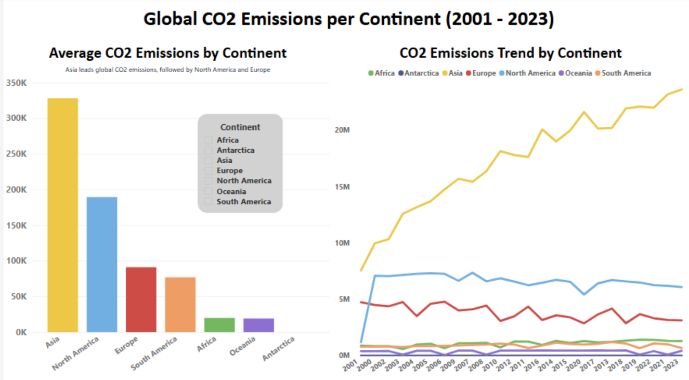

# 🌍 Data Insights: CO₂ Emissions by Country, Region, and Sector   

## Introduction    

This project presents a consultancy case at a **country-level granularity**. The analysis highlights how emissions differ across nations and regions, helping multinational companies, governments, and international organizations prioritize policies, investments, and ESG strategies.  

Climate change is not only an environmental challenge but also a strategic business and policy concern. Carbon dioxide (CO₂) emissions, as the main driver of global warming (IPCC, 2021), directly impact economic stability, regulatory frameworks, corporate sustainability strategies, and long-term investment decisions.  

This project develops an **interactive dashboard in Tableau/Power BI** to track and analyze CO₂ emissions by country, region, and sector. The goal is to provide decision-makers, analysts, and stakeholders with clear insights into emission trends, sectoral contributions, and global disparities.  

By leveraging this analysis, organizations and policymakers can benchmark performance, identify high-impact sectors, evaluate regional progress, and align strategies with global sustainability goals (e.g., Net Zero targets and ESG reporting).  

The dataset used comes from Kaggle:  
Dangi, S. (2024). *CO₂ Emissions across Countries, Regions and Sectors*. Kaggle. Available at: https://www.kaggle.com/datasets/shreyanshdangi/co-emissions-across-countries-regions-and-sectors  

GitHub Project link:  
https://github.com/users/BiancaGemarR/projects/1  

Tableau public link:  
https://public.tableau.com/views/DataInsightsCOEmissionsbyCountryRegionandSector/Dashboard-1Logarithmic?:language=en-GB&:sid=&:redirect=auth&:display_count=n&:origin=viz_share_link

---

## 🎯 Project Objectives  
- Provide a clear and visual overview of CO₂ emissions at global and regional levels.  
- Identify **key sectors** responsible for the majority of emissions.  
- Detect **reduction patterns** in specific countries and regions.  
- Strengthen skills in **data analysis, advanced visualization, and data storytelling**.  
- Communicate findings in an **executive and decision-oriented** manner.  

---

## 📊 Key Analytical Questions  

This project aims to provide answers to the following research questions:  

1. **Which countries contribute the most and the least to global CO₂ emissions?**  
2. **How are CO₂ emissions distributed across continents and regions?**  
3. **What is the relationship between CO₂ emissions and primary energy consumption across time and regions?**  
4. **How do CO₂ emissions correlate with global temperature change over the years?**  
5. **How does Spain’s CO₂ emissions trend compare with other regions in relation to temperature increase?**  
6. **What is the relationship between CO₂ emissions and population, both at country and continental level?**  

---

## 🛠️ Methodology  

**1. Exploratory Data Analysis (EDA)**  
- Reviewed data quality, missing values, and outliers.  
- Identified critical metrics: total, per capita, accumulated, and sectoral emissions.  

### 🔎 Data Cleaning – Python Applied Examples  

```python
# Rename columns: snake_case -> space separated (only where '_' exists)
df_filtrado.columns = [
    col.replace('_', ' ') if '_' in col else col
    for col in df_filtrado.columns]

# Map country -> continent
# diccionario_continentes = {'Spain': 'Europe', 'Qatar': 'Asia', ...}
df_filtrado['Continent'] = df_filtrado['Name'].map(diccionario_continentes)

# Consistent country naming
df_filtrado = df_filtrado.rename(columns={'Name': 'country'})

# Export cleaned data
df_filtrado.to_csv('data_clean_country.csv', index=False)
```
*During this process, we realized that some countries appeared with different column names depending on the source (e.g., territory, regional grouping, developed vs. developing nations). This forced us to clean and standardize them using Python and create two separate CSVs — one for countries and another for regions and economic groups — a small but important step to ensure consistency.*

**2. Data Transformation and Preparation**  
- Cleaned and normalized the dataset.  
- Created new calculated metrics (e.g., % sectoral contribution).  

**3. Visualization Design**  
- Time series to track CO₂ evolution over time.  
- Bar and line charts to compare **average emissions per continent** and their **long-term trends**.  
- Scenario analysis dashboards (e.g., *“What if we exclude China?”*) to show the disproportionate impact of large emitters.  
- Scatter plots *Population vs CO₂* (linear and adjusted scales) with continental trendlines.  
- Bubble charts to visualize **Top 10 emitters**, **Top 10 most populated countries**, and **Top 10 emitters per capita**.  
- Dynamic filters (continent, country, year) for interactive exploration.  

*When designing the dashboards, we debated which charts would be easiest for a non-technical audience to understand. We finally opted for scatter plots and scenario analyses because they allow us to tell the story more intuitively.*  

### 📐 Tableau Code Examples  

```tableau
# % Global Population
SUM([Population]) / SUM([_World Population (LY)])

# CO₂ KPI with Smart Units
IF SUM( IF [It is last year?] THEN [Co2] END ) >= 1000 THEN
    STR( ROUND( SUM( IF [It is last year?] THEN [Co2] END )/1000, 1) ) + " Bn tCO₂"
ELSEIF SUM( IF [It is last year?] THEN [Co2] END ) >= 1 THEN
    STR( ROUND( SUM( IF [It is last year?] THEN [Co2] END ), 1) ) + " MtCO₂"
ELSE
    STR( ROUND( SUM( IF [It is last year?] THEN [Co2] END )*1000, 1) ) + " ktCO₂"
END
```

**4. Interactive Dashboard Creation**  
- Minimalist design with accessible color palette.  
- Included **key KPIs**: global emissions since 2001, top 5 emitting countries, % by sector.  

**5. Scrum Methodology Applied**  
- Work divided into **2 weekly sprints** with clearly defined goals.  
- **Daily stand-ups** to track progress and remove blockers.  
- **Sprint reviews** at the end of each iteration, presenting the dashboard and gathering feedback.  
- **Sprint retrospectives** to continuously improve teamwork and workflow.  
- Agile task management tools were used to ensure transparency and accountability.  

---

## 📌 Key Insights  

### Tableau – Population vs CO₂  
  
*This dashboard compares **population vs CO₂ emissions** with two perspectives: a standard scatter plot and an **adjusted scale** version. It highlights outliers like **China and the US** (total emissions) and **Qatar** (per capita), showing that population alone does not explain emissions.*  

- **2023 Big Numbers**:  
  World population exceeded **8 billion people**.  
  Total CO₂ emissions were **36 billion tonnes**.  
  On average, each person emitted **4.5 tonnes of CO₂** – equivalent to driving ~35,000 km by car in one year (European Environment Agency, 2024).  
  To put it in perspective, the Earth’s circumference is about **40,000 km** (NASA, 2023), meaning the average annual CO₂ emissions per person are similar to driving almost all the way around the planet.

- **Population vs CO₂ (Scatter)**:  
  - Countries above the trendline emit **more CO₂ than expected** given their population (e.g., Qatar).  
  - Countries below the trendline emit **less than expected** (e.g., India).  
  - Outliers in totals: **China and the US**; Outliers per capita: **Qatar and Kuwait**.  
  → The global population explains part of emissions, but not the whole story.  

- **Top 10 Analysis**:  
  - In absolute emissions, **China, the US, and India** dominate.  
  - In population, **India, Nigeria, and Pakistan** appear, but their emission shares differ greatly.  
  - This shows emissions depend more on **energy mix and consumption models** than population alone.  

- **Dual perspective**:  
  - *Total emissions* highlight collective impact (China, US, India).  
  - *Per capita emissions* show inequalities (Qatar, Kuwait, UAE far above global average).  

*One of the insights that surprised us most was the contrast between China and India: similar population size, but very different emissions. This reinforced the importance of looking beyond population and focusing on the energy model.*  

### Power BI – CO₂ Emissions per Continent  
  
*This dashboard shows the **average emissions by continent** (bar chart) and the **evolution of CO₂ emissions** over time (line chart). Asia clearly dominates, while Europe and North America show more stable or declining trends.*  

- **Continental insights**:  
  - Asia leads both in average emissions and growth.  
  - North America remains high but stable.  
  - Europe shows sustained decline since the 2000s, partly reflecting **Kyoto Protocol commitments**.  
  - The **Paris Agreement (2015)** sets long-term targets, but its effects are not yet visible in the data.  

- **Scenario dashboards**:  
  - Excluding a single major emitter (e.g., China) drastically shifts global trajectories.  
  - This illustrates the **disproportionate influence of a handful of countries** on global emissions.  

---

## 💻 Tools Used  
- **Python (pandas, matplotlib, seaborn)** – for data cleaning and exploratory analysis.  
- **Tableau / Power BI** – for advanced visualization and interactive dashboards.  
- **Kaggle Dataset** – main data source.  
- **Scrum Framework** – agile and collaborative project management.  

---

## 📂 Repository Structure  

```bash
PROMO56_PROYECTO_MOD4_TEAM2/
├── EDA/
│   ├── EDA_CO2.ipynb
│   ├── EDA.ipynb
│   └── info.ipynb
├── Power-BI-Dashboards/
│   ├── (1)CO2_Vizualization(Questions1and2).pbix
│   ├── (2) CO2_Vizualization(Questions4and5).pbix
│   └── (3)CO2_Vizualization(Question6).pbix
├── Tableau-Dashboards/
│   ├── (1)Tableau-Dashboard-Question3(Context).png
│   ├── (2)Tableau-Dashboard-Question3(EmissionsxPopulation).png
│   └── (3)Tableau-Dashboard-Question3(EmissionsxPerCapita).png
├── data_clean_country.csv
├── data_clean_regions.csv
├── data.csv
├── research_questions.ipynb
└── README.md
```  

---

## ✔️ Next Steps  
- **Expand dataset scope** to include other greenhouse gases (CH₄, N₂O) for a broader climate impact assessment.  
- **Increase granularity** by analyzing emissions at the subnational level (states/provinces).  
- **Develop forecasting models** using machine learning to project emissions under different energy scenarios.  
- **Assess policy impact** by linking emission trends with international agreements (Kyoto, Paris).  
- **Automate data pipeline** to ensure dashboards remain updated with the latest datasets.  

---

## ✨ Team  
- **Data Analysts, BI Developers, and Data Storytellers:**  
  Ana Nobre, Bianca Gemar, Gabriela Layas, and Zara Valentinova  
  - Extract, transform and load (ETL) processes  
  - Data visualization and dashboard development in Tableau and Power BI  
  - Business storytelling through data insights  

- **Scrum Master & Project Lead:**    
  Ana Nobre  
  - Managed GitHub Project and the Kanban dashboard, ensuring alignment between the team, technical tasks, project objectives, and deadlines
  - Ensured agile practices through daily stand-ups, sprint reviews, and sprint retrospectives  

---

✨ This project showcases **teamwork, agile practices, business-oriented analytics, and executive communication skills** while addressing one of the most critical global challenges of our time.  

---

## References  

European Environment Agency (2024) *CO₂ emissions performance of new passenger cars in Europe*, European Environment Agency, 16 December. Available at: https://www.eea.europa.eu/en/analysis/indicators/co2-performance-of-new-passenger (Accessed: 16 September 2025).  

Intergovernmental Panel on Climate Change (2021) Climate Change 2021: The Physical Science Basis. Contribution of Working Group I to the Sixth Assessment Report of the Intergovernmental Panel on Climate Change. Cambridge University Press. Available at: https://www.ipcc.ch/report/ar6/wg1/ (Accessed: 17 September 2025).

NASA (2023) Earth Fact Sheet. NASA Solar System Exploration. Available at: https://solarsystem.nasa.gov/planets/earth/overview/ (Accessed: 17 September 2025).

